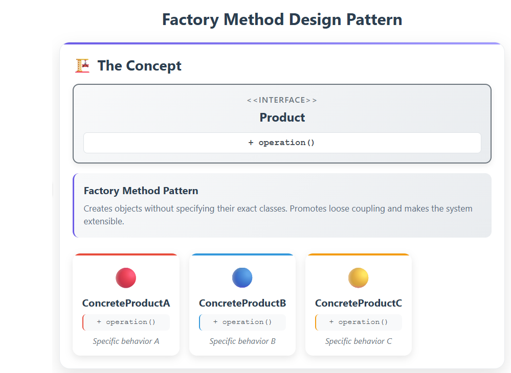
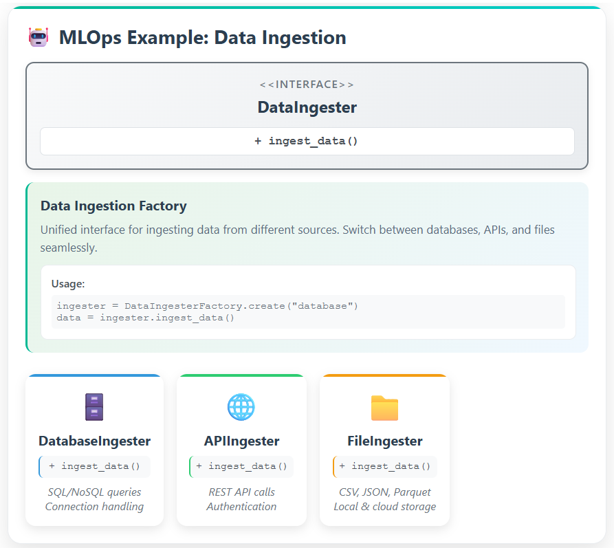
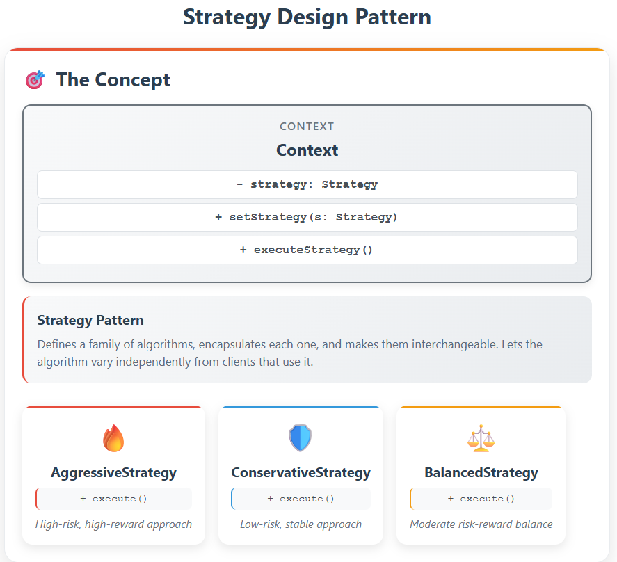
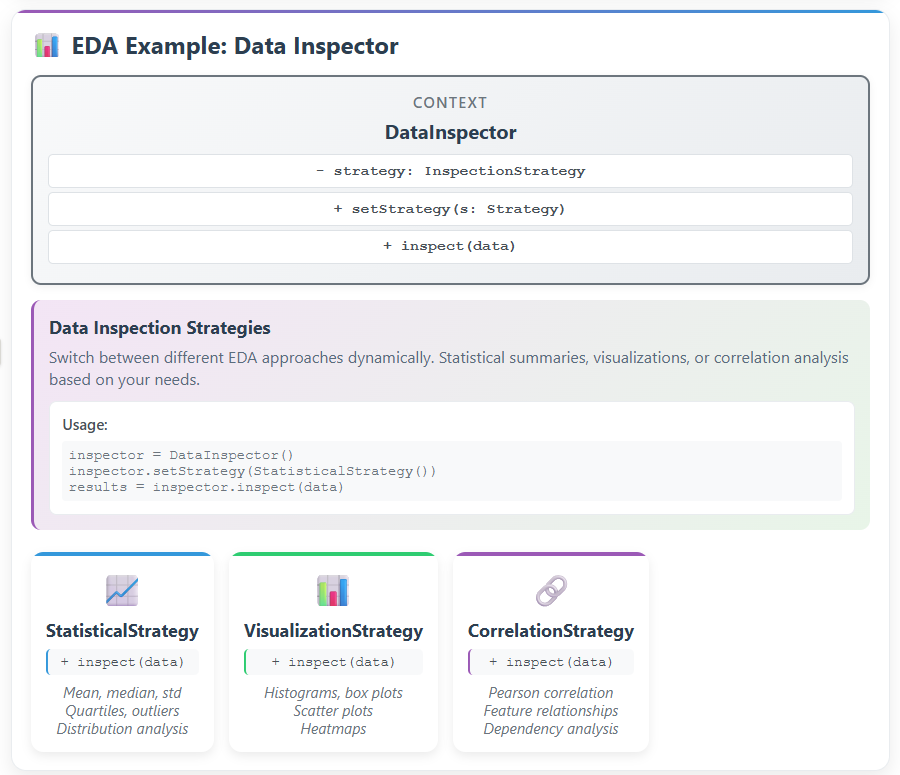

#  MLOps Home Pricing

##  Project Context

**MLOps Home Pricing** is an end-to-end system for predicting house prices using machine learning, with a strong focus on **scalability**, **maintainability**, and **automated deployment workflows**. This project applies **MLOps principles** to enable efficient model lifecycle management.

The goal is not only to create accurate house price predictions but to do so within a **robust operational framework**, allowing continuous improvement, reproducibility, and monitoring at scale.

##  Key Concepts and Practices

This project integrates modern MLOps tools and practices:

### Design Patterns
The project implements key design patterns to ensure maintainable and extensible code:

#### Factory Method Pattern
Used for creating different data ingestion components (database, API, file loaders):

#### Strategy Pattern  
Applied for flexible EDA approaches and model selection strategies:

###  Version Control
- Git is used for tracking code changes and managing branches.
- DVC (Data Version Control) may be used for dataset tracking and reproducibility.

###  Modular Architecture
- Modular code organization following clean architecture principles (data ingestion, preprocessing, training, evaluation, serving, etc.)

###  Continuous Integration / Continuous Deployment (CI/CD)
- Automated testing, linting, and deployment using GitHub Actions.
- Model retraining pipelines triggered on data or code updates.

###  Experiment Tracking
- MLflow or Weights & Biases for tracking experiments, hyperparameters, and model performance.

###  Model Registry
- A centralized registry for storing and versioning trained models.
- Promoting models from staging to production based on evaluation metrics.

###  Scalable Infrastructure
- Containerization with Docker.
- Optional orchestration using Kubernetes or cloud services like Azure/AWS/GCP.
- Offline vs online inference paths.

### Monitoring & Evaluation
- Monitoring data drift, model performance, and serving metrics.
- Alerting for performance drops or anomalies in production.

---

